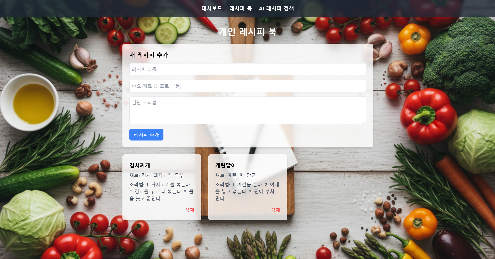
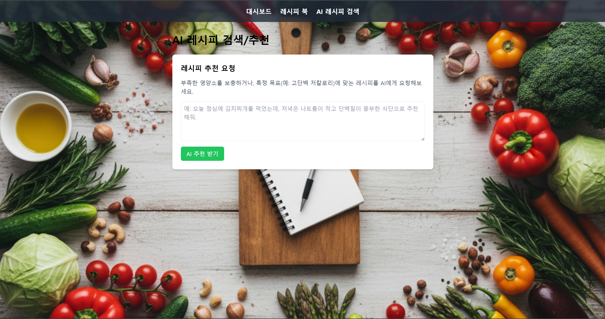

# AI 식단 관리 및 레시피 추천 웹 애플리케이션

AI를 활용하여 식단을 기록하고, 칼로리를 자동으로 계산하며, 맞춤형 레시피를 추천받을 수 있는 웹 애플리케이션입니다.

## ✨ 주요 기능 소개

- **식단 기록 대시보드:**
    - 매일 섭취하는 음식과 양을 기록하고 관리합니다. (Create, Read, Delete)
    - **AI 칼로리 자동 계산:** 음식을 추가하면 AI가 실시간으로 칼로리를 분석하여 보여줍니다.
    - 일일 섭취 총 칼로리를 시각적으로 확인할 수 있습니다.

- **개인 레시피 북:**
    - 나만의 레시피를 재료, 조리법과 함께 저장하고 관리합니다. (Create, Read, Delete)

- **AI 레시피 추천:**
    - 현재 식단 상태나 특정 요구사항(예: "고단백 저칼로리 식단")에 맞춰 AI에게 새로운 레시피를 추천받을 수 있습니다.

## 🛠️ 설치 및 실행 방법

### 사전 요구사항

- [Node.js](https://nodejs.org/) (v18 이상 권장)
- npm (Node.js 설치 시 함께 설치됨)

### 1. 프로젝트 클론

```bash
git clone <저장소_URL>
cd your-project
```

### 2. 백엔드 서버 설정 및 실행

1.  **백엔드 디렉토리로 이동**
    ```bash
    cd backend
    ```

2.  **필요한 라이브러리 설치**
    ```bash
    npm install
    ```

3.  **`.env` 파일 생성 및 API 키 설정**
    - `backend` 폴더 안에 `.env` 파일을 생성합니다.
    - 파일 안에 아래 내용을 작성하고, `sk-...` 부분에 발급받은 OpenAI API 키를 입력합니다.
      ```
      OPENAI_API_KEY=sk-...
      ```

4.  **백엔드 서버 실행**
    ```bash
    node server.js
    ```
    - 터미널에 `백엔드 서버가 http://localhost:3001 에서 실행 중입니다.` 메시지가 나타나면 성공입니다.

### 3. 프론트엔드 서버 설정 및 실행

> **주의:** 백엔드 서버가 실행 중인 상태에서 **새로운 터미널**을 열어 진행하세요.

1.  **프론트엔드 디렉토리로 이동**
    ```bash
    # 프로젝트 루트(your-project)에서 시작
    cd src
    ```

2.  **필요한 라이브러리 설치**
    ```bash
    npm install
    ```

3.  **프론트엔드 개발 서버 실행**
    ```bash
    npm run dev
    ```
    - 터미널에 나타나는 `http://localhost:5173` 와 같은 주소를 웹 브라우저에서 열어 애플리케이션을 확인합니다.

## 💻 기술 스택

- **프론트엔드:**
  - React, Vite, Tailwind CSS, react-router-dom
- **백엔드:**
  - Node.js, Express, cors, dotenv
- **AI:**
  - OpenAI (ChatGPT) API
- **배포 (권장):**
  - 프론트엔드: Netlify / Vercel
  - 백엔드: Render

## 🤖 개발 과정에서의 AI 활용 방법

이 프로젝트는 Gemini AI 어시스턴트와의 협업을 통해 개발되었습니다. AI는 다음과 같은 역할을 수행했습니다.

- **프로젝트 초기 설정:** Vite와 Node.js를 사용한 프론트엔드 및 백엔드 프로젝트 구조를 제안하고 설정했습니다.
- **핵심 기능 구현:** React 컴포넌트 작성, 상태 관리 로직(State Lifting), API 연동 코드 작성을 수행했습니다.
- **아키텍처 설계:** 보안을 위해 API 키를 서버에만 저장하는 BFF(Backend-for-Frontend) 아키텍처를 제안하고 구축했습니다.
- **디버깅:** JSX 문법 오류, API 모델 이름 오류, CORS 정책 문제 등 개발 중 발생한 다양한 오류의 원인을 분석하고 해결책을 제시했습니다.
- **문서 작성:** 개발 가이드라인(`GEMINI.md`)과 현재 이 `README.md` 파일을 프로젝트의 맥락을 이해하여 작성했습니다.

## 스크린샷



